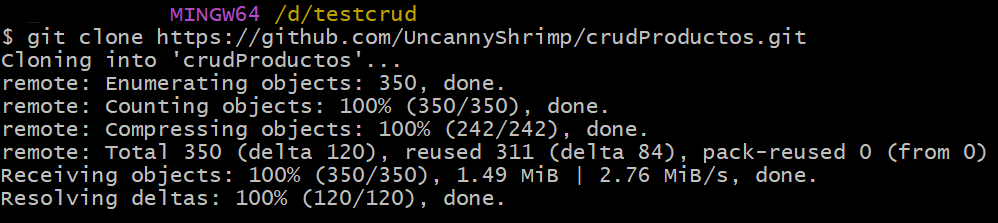
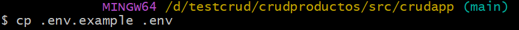
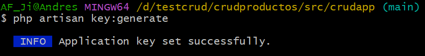

# crudProductos
# CRUD Básico de Productos - Laravel + SQLite

Proyecto sencillo en **Laravel** con un **CRUD completo** de productos (Crear, Leer, Actualizar, Eliminar), utilizando **SQLite** como base de datos por defecto. 

No requiere instalar ni configurar MySQL ni ningún otro servidor de base de datos externo.

Ideal para pruebas rápidas, portafolios, entrevistas técnicas o como base para proyectos pequeños.

## Características principales

- CRUD completo de productos  
- Campos: `id`, `nombre`, `imagen` (ruta), `descripcion`, `precio`, `stock`, `estado` (activo/inactivo)  
- Base de datos **SQLite** (todo en un solo archivo local: `database/database.sqlite`)  
- Datos de ejemplo incluidos automáticamente al migrar  
- Interfaz básica con Blade (se puede mejorar con Bootstrap/Tailwind si lo deseas)

## Requisitos mínimos

- PHP ≥ 8.1  (instalado)  
- Composer (instalado version 2.9.5)  
- Git (instalado git version 2.53.0.windows.1)  
- laravel (Laravel Framework 12.53.0)

## Instalación y uso local (paso a paso usando Git Bash)

1. **Clonar el repositorio**

   git clone https://github.com/UncannyShrimp/crudProductos.git

   

2. **Entrar en el directorio crudapp**

    cd crudproductos/src/crudapp
    

2. **Instalar dependencias de PHPBash**

    composer install
    

3. **Copiar el archivo de entorno**

    cp .env.example .env
    

4. **Genarar la llave del proyecto**

    php artisan key:generate
    

4. **Generar la Base de Datos SQLite**

    touch database/database.sqlite
    

5. **Crear enlace simbólico para storage (donde guaradmos las imagenes)**

    php artisan storage:link
    
    
6. **Ejecutar migraciones + cargar datos de ejemplo**

    php artisan migrate:fresh --seed

    

- Qué hace este comando:
- Borra todas las tablas (si existen)
- Crea la tabla productos
- Inserta 2 productos de ejemplo:
- - Cepillo de dientes – $1.99 – stock 10
- - Enjuague bucal – $9.50 – stock 5

 7. **Iniciar el servidor de desarrollo** 

    php artisan serve 
    

Hecho por Andres Jimenez (ITSCO:2026)
