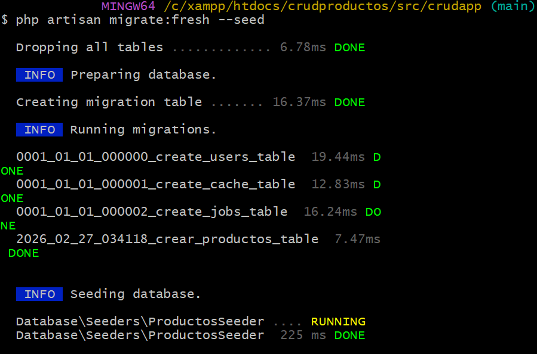

# crudProductos
# CRUD Básico de Productos - Laravel + SQLite

Proyecto sencillo en **Laravel** con un **CRUD completo** de productos (Crear, Leer, Actualizar, Eliminar), utilizando **SQLite** como base de datos por defecto. 

No requiere instalar ni configurar MySQL ni ningún otro servidor de base de datos externo.

Ideal para pruebas rápidas, portafolios, entrevistas técnicas o como base para proyectos pequeños.

## Características principales

- CRUD completo de productos  
- Campos: `id`, `nombre`, `imagen` (ruta), `descripcion`, `precio`, `stock`, `estado` (activo/inactivo)  
- Base de datos **SQLite** (todo en un solo archivo local: `database/database.sqlite`)  
- Datos de ejemplo incluidos automáticamente al migrar  
- Interfaz básica con Blade (se puede mejorar con Bootstrap/Tailwind si lo deseas)

## Requisitos mínimos

- PHP ≥ 8.1  
- Composer  
- Git

## Instalación y uso local (paso a paso)

1. **Clonar el repositorio**

   git clone https://github.com/UncannyShrimp/crudProductos.git

   cd TU-REPOSITORIO

2. **Entrar en el directorio crudapp**

    cd crudproductos/src/crudapp

2. **Instalar dependencias de PHPBash**

    composer install

3. **Copiar el archivo de entorno**

    cp .env.example .env

4. **Base de Datos SQLite**

→ No necesitas modificar .env
Ya viene configurado para usar SQLite:env
    DB_CONNECTION=sqlite
    # DB_DATABASE=database/database.sqlite

5. **Generar la clave de la aplicación**

    php artisan key:generate

6. **Ejecutar migraciones + cargar datos de ejemplo**

    php artisan migrate:fresh --seed

    

- Qué hace este comando:
- Borra todas las tablas (si existen)
- Crea la tabla productos
- Inserta 2 productos de ejemplo:
- - Cepillo de dientes – $1.99 – stock 10
- - Enjuague bucal – $9.50 – stock 5

7. **Crear enlace simbólico para storage**

    php artisan storage:link

 7. **Iniciar el servidor de desarrollo** 

    php artisan serve 
    

Hecho por Andres Jimenez (ITSCO:2026)
